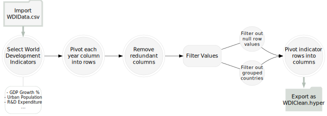

```{r setup, include=FALSE}
knitr::opts_chunk$set(echo = FALSE, message = FALSE, warning = FALSE)
library(kableExtra)
library(pagedown)
library(DiagrammeR)
library(tidyverse)
library(DiagrammeRsvg)
library(magick)
library(ggplot2)
library(dplyr)
library(plotly)
library(hrbrthemes)
library(forcats)
library(viridis)
library(scales)
library(stats)

rhg_cols0 <- c("#48937e", "#5d7f53", "#b5e271", "#f6f28c", "#face6e", 
              "#fda878", "#f781b9", "#d2356f")
rhg_cols <- c("#34544c", "#607d48", "#b6bd67",
              "#fcd476", "#e78247", "#db535b", "#eb9fa9", "#f2d5ce")
```


## Introduction


In the following project, I use Tableau and Python to perform necessary exploratory visual analysis on the real-world *World Development Indicators* data set. The exploratory visual analysis process uses visualizations to explore and form ideas about the data. The process entails looking at the dataset, coming up with a question or hypothesis, iteratively answering the proposed question through visualizations, and describing the final results. Specifically, I formulated one question based on the World Development Indicators data set. Addressing these questions, I manipulated the data and built several visualizations that revealed areas for further exploration and investigation. These various displays included bar charts, scatter plots, maps, time series, and more. In the end, I created a final visualization that best supported the question by presenting a clear resolution. 


### Data Profile

We explore the *World Development Indicators* (WDI) data set downloaded from the World Bank's website for this project. The World Bank Group is an international organization that provides global development data. Downloaded as a zip file, the WDI contains six CSV files. Precisely for this project, I worked with the WDIData.csv file. This rich multivariate data set contains 383,838 rows and 66 columns, including qualitative and quantitative data. The qualitative data includes Country Name, Country Code, Indicator Name, and Indicator Code, whereas the quantitative data consists of a numeric indicator Value. There are 266 unique countries and 1,442 development indicators, covering health, environment, infrastructure, economic policy, education, and more. 


```{r}
df <- data.frame("Column" = c("Country Name", "Country Code", "Indicator Name", "Indicator Code", "1960 to 2020"),
                 "DType" = c("object", "object", "object", "object", "float"),
                 "Unique" = c(266, 266, 1442, 1442, 383838),
                 "Variable Description" = c("Name of country or region", "Abbreviated code for country or region", "Name of measured development indicator", "Abbreviated code for indicator", "Column years ranging from 1960 to 2020"))
```


```{r, fig.cap="Table 1 | Overview and description of the WDI data set."}
knitr::kable(df, col.names = c("Data Columns", "Type", "Unique" ,"Description"), align = "l") %>%
  kable_styling(full_width = T, bootstrap_options = c("basic", "hover"), font_size = 11, html_font = "Roboto Condensed") %>%
  kable_paper(lightable_options =  c("striped", "basic"), font_size = 11, html_font = "Roboto Condensed")%>%
  row_spec(0, color = "white", background = "#33554c")

```


First, scanning the data, one aspect brought to my attention was that the columns labeled from 1960 to 2020 are the years, where each row contains the numeric value for the indicator. Another aspect I noticed is that the indicator names can split into broader topics. For example, we can use a separator dot to split the indicator code column to separate the indicator name fields into more broad topics: Energy Production, Energy Emissions, Exports, Imports, Transportation, Government Finance, and more. Notice that although the indicator name and code variables are thorough, the numeric value for each indicator is not always available, indicated by a null value. Lastly, I realized that specific country names, such as "Arab World" and "European Union," are not countries. Instead, these qualitative values are pre-aggregated groupings of many countries. 

 
```{r,  out.width="100%", out.height="100%"}
df_map <- read.csv('data/map2.csv')
colnames(df_map) <- c("Country", "Code", "Region" ,"Lat", "Long")
# common map properties
g <- list(
  scope = 'world',
  showland = TRUE,
  landcolor = toRGB("grey91"),
  countrycolor = toRGB("gray30"),
  showcountries = TRUE,
  showframe = FALSE,
  showcoastlines = FALSE,
  projection = list(type = 'Mercator'),
  resolution = 90,
  subunitcolor = toRGB("white")
)


fig <- plot_geo(df_map, locationmode = 'world', size = 10)
fig <- fig %>% add_markers(
    x = ~Long, y = ~Lat, color = ~Region, colors=c("#34544c", "#607d48", "#b6bd67",
              "#fcd476", "#e78247", "#db535b", "#eb9fa9", "#f2d5ce")
  )

m <- list(
  l = 5,
  r = 5,
  b = 20,
  t = 20,
  pad = 4
)

fig <- fig %>% layout(geo = g, showlegend = FALSE, autosize = TRUE,  margin=m, height=336)

fig
```


----------------------------------


## Question Exploration


> What are the main direct drivers that influence the changes in CO2 emissions, and how do they change worldwide over time?


The above posed question comes from the information provided in the WDI data set. Greenhouse gases, especially carbon dioxide (CO2) emissions, are one of the leading causes of climate change. The following analysis examines the relationship between global CO2 emissions and economic growth, industrialization, urban population, technology development expenditures, foreign trade, and energy consumption from 1960 to 2018. The first question I asked stems from my interest in the environment. Before starting the analysis, I began by looking at the change in CO2 emission rates in the United States. After a quick examination, I read through academic articles on the driving factors of climate change and CO2 emissions and investigated the relationship between different indicators and emissions. For the overall analysis, my goal is to identify the main trends and direct drivers that affect the changes in CO2 emissions in the world and the largest emitters. Based on my preliminary research, I hypothesize that energy consumption and economic growth are the two main drivers of CO2 emissions, and both drivers increase globally over time. 


### Data exploration

To prepare data for this analysis, I start by importing the WDIData.csv to Tableau Prep. With Tableau Prep, data preparation becomes visual and straightforward. Through the building of flows, we can instantly clean and shape our data for analysis. Beginning the cleaning process, I selected the following relevant indicators outlined in the table below.


```{r}
df1 <- data.frame("Indicator" = c("GDP per capita, PPP", 
                                  "Industry, value added", 
                                  "Urban Population", 
                                  "Research & Development Expenditure", 
                                  "Foreign Direct Investment, net inflows", 
                                  "Total CO2 emissions"),
                  "Measure" = c("current international $", 
                                "% of GDP", 
                                "% of total population", 
                                "% of GDP", 
                                "% of GDP", 
                                "Thousand metric tons"),
                  "Description" = c("Annual percentage growth rate of the sum of gross value added by all residents in economy", 
                                    "Value added in mining, manufacturing, construction, electricity, water, and gas", 
                                    "Number of persons residing in 'urban' area per 100 total population", 
                                    "	Gross domestic expenditures on research and development (R&D), as a percent of GDP", 
                                    "Net inflows of foreign investment in an economy's operating enterprise", 
                                    "Carbon dioxide produced during consumption of solid, liquid, and gas fuels and gas flaring")
                  )

```


```{r, fig.cap="Table 2 | Selected developmental indicators for assessing the first question."}
knitr::kable(df1, col.names = c("Indicator Name", "Measure", "Description")) %>%
  kable_styling(full_width = T, bootstrap_options = c("basic", "hover"), font_size = 11, html_font = "Roboto Condensed") %>%
  kable_paper(lightable_options =  c("striped", "basic"), font_size = 11, html_font = "Roboto Condensed")%>%
  row_spec(0, color = "white", background = "#33554c")
```


I then pivoted the year columns (from 1960 to 2020) into a single variable called *Year* and a corresponding values column labeled as *Indicator Value*. Next, I removed redundant columns such as *Country Code* and *Indicator Code* while removing any null values found in the *Indicator Value*'s column. Then, I converted *Country Name* to a geographic data role and filtered out 47 geographically integrated country groups. Lastly, I transformed the single indicator variable into multiple variable columns, converting rows under *Indicator Name* into columns. 


```{r}
g1 <- grViz("digraph {
  graph [layout = dot, rankdir = LR]

  node [shape = circle, style = filled, fillcolor = whitesmoke, color = lightgray, peripheries = 2, 
        fontname = 'Roboto Condensed', penwidth = 0.4, fixedsize = true, width= 1.05, height = 0.67, 
        fontsize = 10.5, distortion = 0.25, alpha_fillcolor = 85]
  
  edge [arrowsize = 0.75, penwidth = 0.55, color = black]

  import [shape = folder, peripheries = 1, label = 'Import \n WDIData.csv', 
          style = filled, fillcolor=whitesmoke, penwidth = 3, color='#b2beb585']
  
  export [shape = folder, peripheries = 2, label = 'Export as \n WDIClean.hyper', 
          style=filled, color=white,  penwidth = 3, fillcolor = '#b2beb585']
          
  step1 [label = 'Select World \n Development \n Indicators']
  step1a [label = '- GDP Growth % \n - Urban Population \n - R&D Expenditure \n ...', shape = box, height = 0.758, peripheries =1,
          style = rounded, color = '#b2beb5', fontcolor = DarkGray, fontsize = 8, width = 1]
  
  step2 [label =  'Pivot each \n year column \n into rows']
  step3 [label = 'Remove \n redundant \n columns']
  
  step4 [label = 'Filter Values', shape = box, style='filled, rounded', height = 0.6, 
          peripheries =1, fillcolor = whitesmoke]
  step4a [label = 'Filter out \n null row \n values', width = 0.7, fontsize = 9, 
          peripheries =1, fillcolor = whitesmoke]
  step4b [label = 'Filter out \n grouped \n countries', width = 0.7, fontsize = 9,
          peripheries =1, fillcolor = whitesmoke]
  step5 [label = 'Pivot indicator \n rows into \n columns']
  
  step1 -> step2 -> step3 -> step4

  import -> step1	[arrowhead=e, color='#b2beb5',style=filled, minlen = 0.2, penwidth = 3, arrowsize = 0.5]
  
  step1 -> step1a [arrowhead = none, minlen = 0.2, color=gray]
  
  step4a -> step4b [arrowhead=none, minlen = 0.2, color = white]
  step4 -> {step4a step4b} [arrowhead=none]
  {step4a step4b} -> step5 [headport = w]
  
  step5 -> export [arrowhead=e, color='#b2beb5',style=filled, minlen = 0.2, penwidth = 3, arrowsize = 0.5]
  
}")
```


```{r}
svg <- g1 %>% export_svg()

fileConn<-file("assets/flow1.svg")
writeLines(svg, fileConn)
close(fileConn)
```

```{r}
#
```


### Data Visualizations


Now that the data is in a workable format, I start the visual exploratory analysis in Tableau. Exploratory visual analysis is often an iterative process. Hence, I manipulated and created various intermediate views in an attempt to assess the data-related question. First, I made a simple bar chart to show the total CO2 emissions by countries. I filtered the data to include only the top 8 emitting countries.


```{r}
df_total <- read.csv("data/total_co2.csv")
colnames(df_total) <- c("Country", "Total_CO2_Emissions")
df_total[df_total == "Russian Federation"] <- "Russia"
df_total[df_total == "United Kingdom"] <- "Britain"


```

```{r, out.width="100%", out.height="150%"}
library(dplyr)
library(scales)
library(latex2exp)
library(tikzDevice)


p <- df_total %>%
    mutate(text = paste("Country: ", Country, sep="")) %>%

  arrange(Total_CO2_Emissions) %>%
  ggplot( aes(x=Country, y=Total_CO2_Emissions, group = Country, fill=Country, text=text)) + 
  geom_bar(stat="identity") + scale_fill_manual(values = rhg_cols) +
  scale_y_continuous(labels = label_number(suffix = " M", scale = 1e-6)) +
  ggtitle(label = "Total CO2 Emissions By Country | 1960-2018") +
  ylab(label = "$CO_2 \\text{ Emissions (thousand tonnes)}$")+ 
  xlab(label = "") + theme_minimal() +
  theme(legend.position = "none",
        plot.title = element_text(size = 11, color="black", family = "Frank Ruhl Libre"),
        legend.text = element_text(size=8, color="#36454f", family = "Frank Ruhl Libre"),
        legend.title = element_text(colour = "white", size = 0),
        axis.title.x  = element_text(size=9, color="#36454f", family = "Frank Ruhl Libre"),
        axis.title.y  = element_text(size=8, color="#36454f", family = "Frank Ruhl Libre"),
        axis.text = element_text(colour = "gray", family = "Roboto Condensed", face="bold"),
        axis.text.x = element_text(size = 9),
        axis.text.y = element_text(size = 8))

m2 <- list(
  l = 5,
  r = 5,
  b = 30,
  t = 30,
  pad = 4
)

p <- ggplotly(p, tooltip = "text") %>% config(mathjax = 'cdn') %>% layout(autosize = T, height = 336, margin=m2)

p


```


Based on the above, the top emitting countries are the United Kingdom, Canada, China, Germany, India, Japan, Russia, and the United States. Next, I made a simple time series chart to show the annual changes in CO2 emissions. I filtered the data to include only the top 8 emitting countries, and then I plotted the data available over time to observe any trends.


```{r, out.width="100%", out.height="80%"}
df <- read.csv("data/yearly_co2.csv")
p <- df %>%
  mutate(text = paste("Country: ", Country.Name, "\nYear: ", ï..Year.of.Year, sep="")) %>%
  
  arrange(Total.CO2.emissions..thousand.metric.tons.of.CO2.) %>%
  mutate(Country = factor(Country.Name, levels=c("United States", "China", "Russian Federation", "Japan", "India", "United Kingdom", "Canada", "Germany"))) %>%
  ggplot( aes(x=ï..Year.of.Year, y=Total.CO2.emissions..thousand.metric.tons.of.CO2., group = Country, color=Country, text=text)) + 
  geom_line(size=0.75) + scale_color_manual(values = rhg_cols) + theme_minimal() +
  scale_y_continuous(labels = label_number(suffix = " M", scale = 1e-6)) +
  ggtitle(label = "Annual CO2 Emissions By Country | 1960-2018") +
  ylab(label = "$CO_2 \\text{ Emissions (thousand tonnes)}$")+ 
  xlab(label = "") +
  theme(plot.title = element_text(size = 11, color="black", family = "Frank Ruhl Libre"),
        legend.text = element_text(size=8, color="#36454f", family = "Frank Ruhl Libre"),
        legend.title = element_text(colour = "white", size = 0),
        axis.title.x  = element_text(size=9, color="#36454f", family = "Frank Ruhl Libre"),
        axis.title.y  = element_text(size=9, color="#36454f", family = "Frank Ruhl Libre"),
        axis.text = element_text(colour = "gray", family = "Roboto Condensed", face="bold"),
        axis.text.x = element_text(size = 9),
        axis.text.y = element_text(size = 8)) +
  scale_x_continuous(n.breaks = 8)

m3 <- list(
  l = 0,
  r = 0,
  b = 30,
  t = 30,
  pad = 0
)


p <- ggplotly(p, tooltip = "text") %>% layout(autosize = TRUE,  margin=m3,height=356)  %>% config(mathjax = 'cdn')
#p
p
```


In the above, we can compare the total CO2 emissions of the top emitting countries. The plot shows that the total CO2 emissions is much higher in the US than in other countries. However, since the population of the US and nations such as India and China aren't comparable, we cannot make a proper inference on whether there is a significant difference in total CO2 emissions among these countries. Although this view provides a glimpse into the leading countries and trends in yearly CO2 emissions, it does not offer any insight into the driving factors of emission rates. Moving forward, I begin finding different ways to showcase CO2 emissions related to other indicators that measure economic growth. Specifically, in the following, I created a scatter plot for 2018 illustrating CO2 emissions with GDP per capita that uses logarithmic scales on both the horizontal and vertical axes. In addition, the size of each measure shows the total population. 


```{r}
df2 <- read.csv("data/co2_gdp.csv")
rhg_cols <- c("#34544c", "#607d48", "#b6bd67",
              "#fcd476", "#e78247", "#db535b", "#eb9fa9", "#f2d5ce")
```

```{r, out.width="100%", out.height="80%"}
# Interactive version
p <- df2 %>%
  mutate(Population..total=round(Population..total/1000000,3)) %>%
  mutate(GDP.per.capita..PPP..current.international... = round(GDP.per.capita..PPP..current.international..., 2)) %>%
  mutate(CO2.emissions..metric.tons.per.capita. = round(CO2.emissions..metric.tons.per.capita., 2)) %>%

  arrange((Population..total)) %>%
  mutate(country = factor(ï..Country.Name, ï..Country.Name)) %>%
  mutate(text = paste("Country: ", country, "\nRegion: ", Regiona, "\nGDP per capita: ", GDP.per.capita..PPP..current.international..., "\nCO2 Emissions: ", CO2.emissions..metric.tons.per.capita., sep="")) %>%
  ggplot(aes(x=GDP.per.capita..PPP..current.international..., 
             y=CO2.emissions..metric.tons.per.capita., 
             size=Population..total, color=Regiona, text=text)) +
    geom_point(alpha=0.85) +
    scale_size(range = c(0.4, 15)) +
    scale_color_manual(values = rhg_cols, guide="none") +
  scale_x_continuous(trans='log2', labels = label_number(suffix = " K", scale = 1e-3)) +
  scale_y_continuous(trans='log2') +
    theme_minimal() +
  ggtitle(label = "CO2 Emissions & GDP per Capita | 2018") +
  ylab(label = "$CO_2 \\text{ Emissions (thousand tonnes)}$")+ 
  xlab(label = "GDP per capita, PPP") +
  theme(plot.title = element_text(size = 11, color="black", family = "Frank Ruhl Libre"),
        axis.title.x  = element_text(size=9, color="#36454f", family = "Frank Ruhl Libre"),
        axis.title.y  = element_text(size=9, color="#36454f", family = "Frank Ruhl Libre"),
        axis.text = element_text(colour = "gray", family = "Roboto Condensed", face="bold"),
        axis.text.x = element_text(size = 9),
        axis.text.y = element_text(size = 8),
        legend.text = element_text(size=8, color="#36454f", family = "Frank Ruhl Libre"),
        legend.title = element_text(colour = "white", size = 0),
        legend.position = "top")

t <- list(
  family = "Frank Ruhl Libre",
  size = 10,
  color = '#36454f')

pp <- ggplotly(p, tooltip="text") %>% layout(autosize = TRUE,  margin=m3, height=336, legend=list(font=t)) %>% config(mathjax = 'cdn')
pp
```


```{r}
#knitr::include_graphics("assets/CO2_vs_GDP.png", dpi = 200)
```


The above chart shows that GDP has an overall positive influence on CO2 emissions. In general, GDP per capita is a broad measure of economic growth; so with these findings, we can say that country economic growth measured by GDP per capita contributes to increased CO2 emissions. While this view provides a glimpse into the relationship between CO2 emissions, GDP rates, and the total population, it does not give insight into other potential driving factors of emission rates. Moving forward, I begin to incorporate a more multivariate view by finding different ways to plot both the CO2 emissions with several indicators. As follows, I present a multivariate view of the relationship between CO2 emissions and GDP growth, urban population, technology development, and foreign investments.


### PCA Analysis

Here, we begin by visualizing all the principal components. Using PCA analysis, we use the  `splom` trace to display our results, and our features are the resulting principal components, ordered by how much variance they are able to explain. The importance of explained variance is demonstrated in the plots below.

```{r}
#knitr::include_graphics("assets/CO2Final.png", dpi = 90)
df3 <- read.csv("data/PCA1.csv") %>% 
  drop_na()

colnames(df3) <- c('Country','Region', 'Total_CO2_Emissions', 
                   'CO2_Emissions_kgPPP', 'CO2_Emissions', 'Foreign_Investment',
                   'GDP_Growth', 'GDP_perCapita', 'Industry_Value', 'Population', 
                   'Research', 'Urban_Population')

## Subset out categorical columns
X <- subset(df3, select = -c(Country, Region, Total_CO2_Emissions, CO2_Emissions_kgPPP, GDP_perCapita, Population))
```


```{r}
## Principal Components Analysis
prin_comp <- prcomp(X)

## Explained Variance Ratio 
explained_variance_ratio <- summary(prin_comp)[["importance"]]['Proportion of Variance',]
explained_variance_ratio <- 100 * explained_variance_ratio

## Components Dataframe
components <- prin_comp[["x"]]
components <- data.frame(components)
components <- cbind(components, df3$Country)
components <- cbind(components, df3$Region)

components$PC3 <- -components$PC3
components$PC2 <- -components$PC2
```

```{r, out.width="90%", out.height="100%"}
m4 <- list(
  l = 50,
  r = 50,
  b = 30,
  t = 30,
  pad = 0
)
axis = list(showline=FALSE,
            zeroline=FALSE,
            gridcolor='#ffff',
            ticklen=3,
            titlefont=list(size=9, color='black'),
            tickfont = list(family='Roboto Condensed', color='grey30', size=8))

fig <- components %>%
  plot_ly(height=336)  %>%
  add_trace(type = 'splom',
            dimensions = list(
              list(label = paste('PC 1 (',toString(round(explained_variance_ratio[1],1)),'%)', 
                                 sep = ''), values=~PC1),
              list(label=paste('PC 2 (',toString(round(explained_variance_ratio[2],1)),'%)',
                               sep = ''), values=~PC2),
              list(label=paste('PC 3 (',toString(round(explained_variance_ratio[3],1)),'%)',
                               sep = ''), values=~PC3),
              list(label=paste('PC 4 (',toString(round(explained_variance_ratio[4],1)),'%)',
                               sep = ''), values=~PC4)),
            color = ~df3$Region, 
            colors = c("#34544c", "#607d48", "#b6bd67",
              "#fcd476", "#e78247", "#db535b", "#eb9fa9", "#f2d5ce")) %>%
  style(diagonal = list(visible = FALSE)) %>%
  layout(
    showlegend= FALSE,
    legend=list(title=list(text='color')),
    hovermode='closest',
    dragmode= 'select',
    plot_bgcolor='rgba(240,240,240, 0.95)',
    xaxis=list(titlefont = list(size=9, color="black"), domain=NULL, showline=F, zeroline=F, gridcolor='#ffff', ticklen=3, tickfont = list(family='Roboto Condensed', color='grey30', size=8)),
    yaxis=list(titlefont = list(size=9, color="black"), domain=NULL, showline=F, zeroline=F, gridcolor='#ffff', ticklen=3, tickfont = list(family='Roboto Condensed', color='grey30', size=8)),
    xaxis2=axis, xaxis3=axis, xaxis4=axis,
    yaxis2=axis, yaxis3=axis, yaxis4=axis,
    autosize = TRUE,  margin=m4, height=320)

fig


```


Overall, the above plot allows us to visualize high-dimensional PCs of our data grouped by region. Next, we visualize the first two principal components of a PCA. We also visualize the loadings of our PCA analysis using annotations to indicate which feature a certain loading original belongs to. Here, we define loadings as ${\small\textrm{loadings}} = \mathbf{v} \cdot \sqrt{\mathbf{\lambda}}$, where $\mathbf{v}$ denotes the eigenvector and $\mathbf{\lambda}$ denotes the eigenvalues.


```{r,out.width="100%", out.height="100%"}
prin_comp <- prcomp(X, rank. = 2, scale. = TRUE, tol = 0.1)
components <- prin_comp[["x"]]
components <- data.frame(components)
components <- cbind(components, df3$Region)
components$PC2 <- -components$PC2
explained_variance <- summary(prin_comp)[["sdev"]]
explained_variance <- explained_variance[1:2]
comp <- prin_comp[["rotation"]]
comp[,'PC2'] <- - comp[,'PC2']
loadings <- comp
for (i in seq(explained_variance)){
  loadings[,i] <- comp[,i] * explained_variance[i]
}

features = c(' ', 'Foreign \nInvestment', 'GDP', 'Industry \nValue', '    R&D', 'Urban \nPopulation')
t <- list(
  family = "Frank Ruhl Libre",
  size = 10,
  color = '#36454f')
t2 <- list(
  family = "Frank Ruhl Libre",
  size = 11,
  color = 'black')

fig <- plot_ly(components, x = ~PC1, y = ~PC2, color = ~df3$Region, colors = c("#3b5c53", "#698452", "#b6bd67","#fddf99", "#ea8f5b", "#e0656c", "#ea9fa9", "#f2d5cf"), type = 'scatter', mode = 'markers',alpha = 0.9, marker = list(size = 11)) %>%
  layout(
    legend=list(title=list(text='Region'), font=t),
    plot_bgcolor = "white",
    xaxis = list(
      title = "0", range=list(-2,2.5)),
    yaxis = list(
      title = "1", range=list(-2.5, 3)),
    autosize = TRUE,  margin=m, height=336)
for (i in seq(6)){
  fig <- fig %>%
    add_segments(x = 0, xend = loadings[i, 1], y = 0, yend = loadings[i, 2] + 0.1, line = list(color = 'black'),alpha=0.65, inherit = FALSE, showlegend = FALSE) %>%
    add_annotations(x=loadings[i, 1], y=loadings[i, 2] + 0.1, ax = 0, ay = 0,text = features[i], xanchor = 'center', yanchor= 'bottom', font=t2)
}

fig

```


The above visualization provides a multivariate analysis and view of carbon dioxide emissions, GDP growth, industrialization, urbanization, technology development, and foreign investments in the world using the PCA during the period 1970-2018. Based on these results, increased industrialization and economic growth measured in terms of GDP per capita seem to be the leading factors in influencing the rise of CO2 emissions.


------------------------------------

## Reflection


Overall, the goal of this project is to create meaningful visualizations to explore and effectively translate the rich and multivariate data set to pose new questions and solutions. Other than learning the skills to clean, organize and display data, I also got to learn how to focus on the data that is important to me and filtering out other irrelevant information, which, I believe, is a great skill especially when working with a large data set. When examining the data and constructing the visualizations, I used Tableau Prep, Python, and Tableau. Specifically, for manipulating data, I used Tabelau Prep and Python while for creating visualizations, I used Tableau.


For question one, my goal was to study the main drivers that influence CO2 emissions. In particular, when creating the final visualization for the first question, I wanted to focus on presenting worldwide driving factors and trends of CO2 emissions. So, I chose to use a multivariate graph. The final visualization successfully demonstrates data patterns for different developmental indicators, but the diagram is relatively weaker in showing changes over time. Based on my results, economic growth is the primary factor influencing CO2 emissions.


Overall, I found this project to be challenging but exciting. I learned that exploratory analysis is an iterative process. This process involved refining questions, trying new views, altering my approach, and repeating as necessary until I reached a compelling answer in the form of a visualization. Although there are certain conventions to follow, I also learned that there's no perfect data visualization as each one has its advantages and disadvantages. However, as creators of the visualization, it's essential to consider the mindset of our audience when creating meaningful visualizations that successfully present information from the data.


---------------------------------------------------


## References


